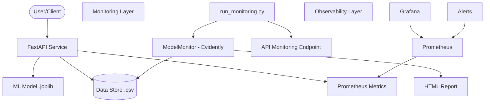

# System Architecture

The ML Model Monitoring System is designed to provide real-time insights into model performance and data health. It utilizes a microservices-inspired architecture with specialized components for API serving, monitoring, and observability.

## Component Overview

### 1. API Service (FastAPI)
- **Role**: Serves model predictions and provides management endpoints.
- **Metrics**: Exposes Prometheus metrics related to drift and accuracy.
- **Persistence**: Logs prediction requests to `data/current.csv`.

### 2. Monitoring Layer (Evidently AI)
- **Role**: Analyzes data and model performance.
- **Features**:
    - Data Drift Detection
    - Prediction (Target) Drift Detection
    - Classification Performance Analysis
- **Output**: Generates comprehensive HTML reports stored in `reports/`.

### 3. Observability Layer (Prometheus & Grafana)
- **Prometheus**: Scrapes metrics from the API and stores them as time-series data.
- **Grafana**: Visualizes metrics through interactive dashboards.
- **Alerting**: Monitors metric thresholds and signals potential issues.

## Data Flow

1. **Inference**: Client sends features to `/predict`. API returns prediction and logs data.
2. **Monitoring Trigger**: `/monitoring/run` is called (manually or via CRON).
3. **Report Generation**: Evidently compares `reference.csv` and `current.csv`.
4. **Metrics Update**: API updates Prometheus Gauges with the latest drift and accuracy scores.
5. **Visualization**: Grafana reflects the updated metrics in the dashboard.
